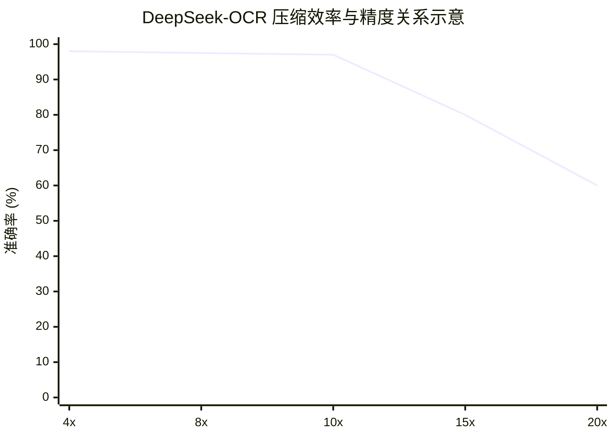

---
{"dg-publish":true,"permalink":"/知识/人工智能·模型/实例/deepseek-ocr/","title":"DeepSeek-OCR：上下文光学压缩","tags":["人工智能/模型"],"noteIcon":""}
---

> **一图胜千言。**
> 
> 那么，读懂千言，需要多少“像素”？
> 
> DeepSeek-OCR 以其“上下文光学压缩”之道，给出了自己的答案：它并非贪婪地吞噬所有视觉细节，而是像一位深思熟虑的读者，只撷取形成理解所必需的核心信息。这标志着文档智能的焦点，正从“看清每一个字”的像素级还原，转向“读懂整页文”的语义级理解。

## 背景

当前的开源VLM采用三种主要类型的视觉编码器：
- 双塔架构：双路SAM编码器预处理（ViT+ViTDet）
	- 优点：参数规模可控，高分辨率下显存占用友好
	- 缺点：双路预处理，部署复杂，并行训练优化困难
	- 代表：DeepSeekVL
- 瓦片架构：先对图像进行瓦片式图像分割，然后并行SAM
	- 优点：瓦片式图像分割对高分辨率下显存占用做了优化
	- 缺点：瓦片尺寸大小限制，大型图像过度碎片化，Token总数增加
	- 代表：InternVL 2.0
- 自适应分辨率架构：通过基于补丁的多分辨率图像分割直接处理完整图像
	- 优点：可灵活处理不同分辨率
	- 缺点：大型图像处理有较高显存占用，训练中Token序列长度不友好
	- 代表：Qwen2-VL

为探索上下文光学压缩，我们需要一种具有以下特点的视觉编码器：
1. 支持多分辨率输入，参数规模适中
2. 能够处理高分辨率，且高分辨率下仍保持低激活
3. 视觉Token长度小

## 架构

- 编码器
	- SAM层（窗口注意力）：ViTDET，80M
	- 卷积层（压缩）
		- 2层卷积，16x下采样
		- 卷积核：大小3，步幅2，填充1
		- 通道：256~1024
	- CLIP层（全局注意力）：ViT，300M
		- CLIP-large嵌入层
		- 删除了第一个补丁嵌入层

- 解码器：**DeepSeek3B-MoE-A570M**
	- 深度：共12层（PP2和PP3各6层）
	- 专家：每次激活6个领域专家（共64个）和2个共享专家
	- 参数：每次激活570M（共3B）

> 这个架构成功的关键在于**编码器**部分，它通过串联SAM-base（负责局部视觉感知）和CLIP-large（负责全局语义理解），并在中间加入一个**16倍下采样**的卷积压缩模块，成功将高分辨率图像压缩为极少的视觉Tokens。

## 实际效果

| **模式** | **分辨率**   | **视觉Token数** | **特点与适用场景**                                                                                            |
| ------ | --------- | ------------ | ------------------------------------------------------------------------------------------------------ |
| Tiny   | 512×512   | 64           | 基础识别，速度快                             |
| Small  | 640×640   | 100          | 平衡效率与精度，在OmniDocBench超越GOT-OCR2.0  |
| Base   | 1024×1024 | 256          | 通用场景，高保真                                                       |
| Large  | 1280×1280 | 400          | 高精度解析，复杂版面                           |
| Gundam | 动态        | <800         | 处理超长文档，在OmniDocBench超越MinerU2.0                                                                        |

压缩比：
1. 10x压缩比，准确率~97%：对于绝大多数应用场景（如文档数字化、信息检索），这个压缩率能提供足够高的精度。
2. 20x压缩比，准确率~60%：当压缩超过某个临界点后，信息损失开始急剧增加，精度呈断崖式下降。
	- 长文档布局复杂，可调整分页方式解决
	- 逼近理论极限：

## 训练数据

- **OCR 1.0数据**：用于基线训练的传统OCR数据集
	- 文档数据
		- 30M页的多样化PDF数据
			- 涵盖约100种语言：中文和英文约25M，其他语言约5M
			- 两种注解
				- 粗略：用fitz直接从完整数据集中提取，旨在教模型识别光学文本，尤其是少数语言
				- 精细：中英文各2M页，用高级模型PP-DocLayout和MinuerU、GOT-OCR2.0构建，用于检测和识别交错数据
		- 3M的Word数据
			- 直接提取内容来构建高质量的图像文本对，无需布局
			- 有助识别公式和HTML表格
		- 开源数据补充：[28](https://arxiv.org/html/2510.18234v1#bib.bib28), [37](https://arxiv.org/html/2510.18234v1#bib.bib37)
	- 自然场景OCR
		- [LAION](https://arxiv.org/html/2510.18234v1#bib.bib31), [悟空](https://arxiv.org/html/2510.18234v1#bib.bib13)
		- 注解：用PaddleOCR，中英文各10M

- **OCR 2.0数据**：高级合成和真实世界文档数据（图表、化学式和平面几何）
	- 图表
		- 遵循[OneChart](https://arxiv.org/html/2510.18234v1#bib.bib7)，用pyecharts和matplotlib渲染
		- 10M图像，包括折线图、条形图、饼图和复合图
		- 将图表解析定义为图像到HTML表格的转换任务
	- 化学式
		- 用PubChem的SMILES格式作为数据源，使用RDKit将其渲染成图像
		- 5M图像文本对
	- 平面几何
		- 遵循[慢速感知](https://arxiv.org/html/2510.18234v1#bib.bib39)]，使用感知标尺大小4对每条线段进行建模
		- 为增加渲染数据多样性，引入了几何平移不变数据增强
		- 1M平面几何解析数据

- 其它训练数据
	- **一般视觉数据**：多样化的图像数据集，用于更广泛的视觉理解
		- 为字幕、检测和接地等任务生成相关数据
		- 非通用VLM模型，训练数据仅占比20%（为提供信息做视觉模型研究分析）
	- **纯文本数据**：纯语言数据，增强解码器能力
		- 纯文本预训练数据，占比10%左右
		- 所有数据处理长度为8192个token

## 两阶段学习

1. **训练DeepEncoder**：侧重于优化视觉编码器以实现高效压缩
	- 数据：使用OCR 1.0、OCR 2.0和LAION采样的100M通用数据
	- 模型：解码器
	- 优化器：AdamW（余弦退火调度），学习率为5e-5
	- 2个epoch，批大小为1280，训练序列长度为4096

2. **训练Decoder并微调Encoding的嵌入层**：将编码器与解码器集成，对整个系统进行微调
	- 数据：全部数据
	- 模型：
		- 把编码器的SAM层和卷积压缩层视为分词器，放在PP0中并冻结其参数
		- 将编码器的CLIP层视为嵌入层，并将其放在具有未冻结权重的PP1中训练
		- 对作为解码器的语言模型DeepSeek3B-MoE，则在PP2和PP3中各放了6层
	- 优化器：使用AdamW（步进调度），初始学习率3e-5
	- 硬件：20个节点（每节点8个A100-40G），数据并行度（DP）为40，全局批量大小为640
		- 纯文本：90B（每天）
		- 多模态：70B（每天）

## 记忆、视觉与文本（上下文）

类比记忆、视觉和文本的上下文中的处理方式。

## 一些不成熟的想法

- 当下游任务更为复杂时，加载到注意力模型中是否需要完整的恢复整个文本嵌入（乐观）
- 其它注意力优化技术与视觉嵌入压缩是否可以兼容，并强强联手保留可观的受益（中立）
- 类比记忆遗忘等有一些牵强（学术营销），需重新思考定位、价值及落地场景（中立）

## 参考资料

- [DeepSeek-OCR主页](https://deepseek.ai/blog/deepseek-ocr-context-compression)
- [DeepSeek-OCR源码](https://github.com/deepseek-ai/DeepSeek-OCR)
- [DeepSeek-OCR论文](https://arxiv.org/abs/2510.18234)

