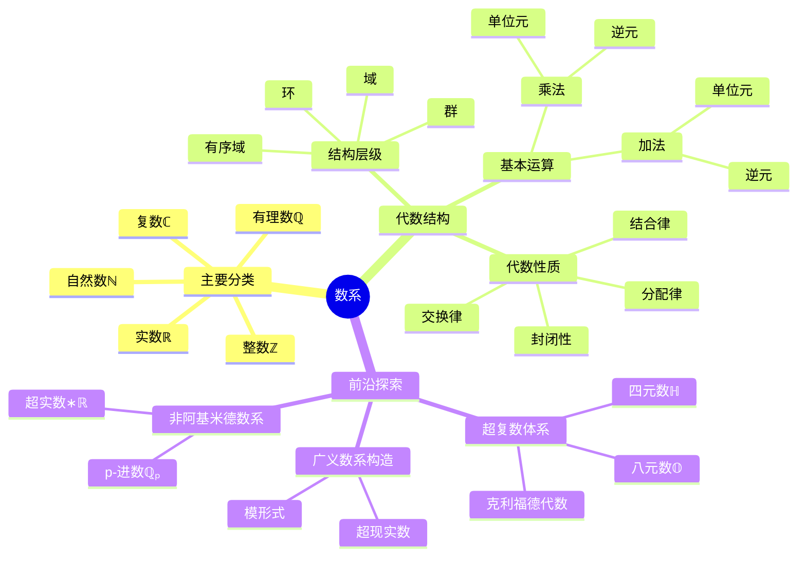

---
{"dg-publish":true,"permalink":"/知识/人工智能·理论/数学理论/number/","title":"数系","noteIcon":""}
---

> 自然数ℕ → 整数ℤ → 有理数ℚ → 实数ℝ → 复数ℂ

数系的扩张，并非数字的简单堆积，而是一部人类思维的创世记：从“有”与“无”的朴素分野，到叩问“无限”的深邃苍穹，每一次边界的突破，都是理性对经验世界的背叛与超越。我们于整数中确立秩序，在分数间解构整体，向无理数臣服于绝对的精确，最终在复数的虚像里，窥见现实更完整的维度。

| 名称  | 数系  |  加  |  减  |  乘  |  除  |  群  |  环  |  域  | 有序域 |
| :-: | :-: | :-: | :-: | :-: | :-: | :-: | :-: | :-: | :-: |
| 自然数 |  ℕ  |  ✅  |  ❌  |  ✅  |  ❌  |  ❌  |  ❌  |  ❌  |  ❌  |
| 整数  |  ℤ  |  ✅  |  ✅  |  ✅  |  ❌  |  ✅  |  ✅  |  ❌  |  ❌  |
| 有理数 |  ℚ  |  ✅  |  ✅  |  ✅  |  ✅  |  ✅  |  ✅  |  ✅  |  ✅  |
| 实数  |  ℝ  |  ✅  |  ✅  |  ✅  |  ✅  |  ✅  |  ✅  |  ✅  |  ✅  |
| 复数  |  ℂ  |  ✅  |  ✅  |  ✅  |  ✅  |  ✅  |  ✅  |  ✅  |  ❌  |
