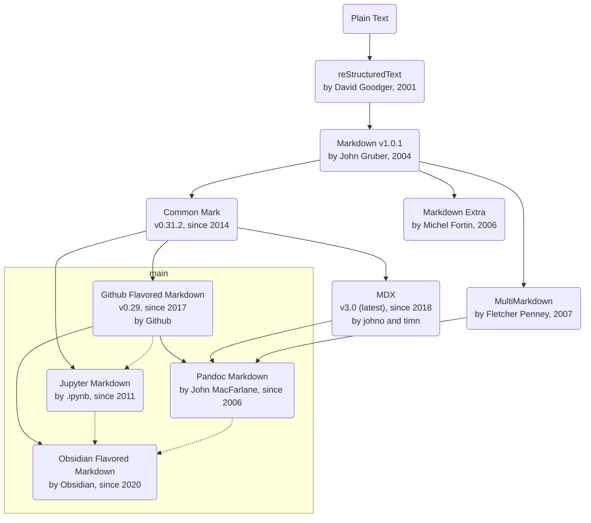
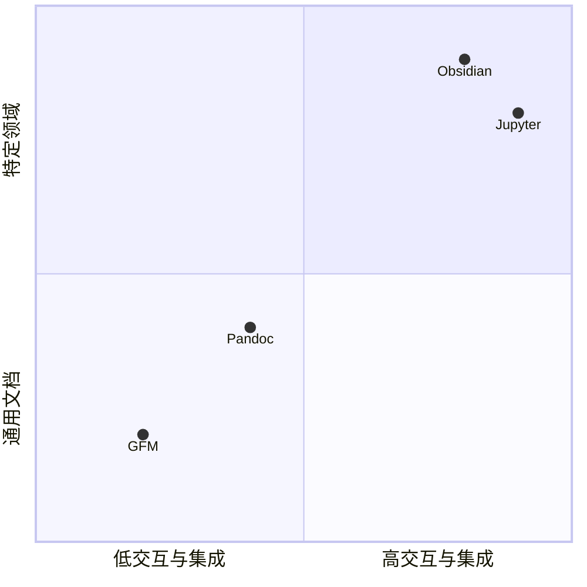

---
{"dg-publish":true,"permalink":"/知识/内容创作/markdown/markdown/","title":"Markdown：从极简主义，到包罗万象","tags":["内容创作","markdown"],"noteIcon":""}
---


> 让理性有层次，让文字有温度。

## 简介

Markdown是一种[轻量级标记语言(LML)](https://en.wikipedia.org/wiki/Lightweight_markup_language)，它的特点是：
- 重内容创作，轻样式排版
- 人类阅读书写友好，学习和使用简单
- 流行度高，社区支持广泛，工具丰富，扩展性强
- 可渲染为HTML网页，便于发布和展示

Markdown比较适合的创作场景有：
- 电子书、开发文档
- 技术博客、静态内容网站
- 个人笔记

## 演进



## 方言

目前被广泛使用的Markdown方言主要是：
- Github：GitHub推出的代码协作与开源文档标准，目前最广泛使用的Markdown方言之一。
- Pandoc：Pandoc是一个文档转换工具，其支持的Markdown方言是学术写作上的瑞士军刀。
- Jupyter：Jupyter是一个数据科学的实验平台，侧重交互计算和数据可视化。
- Obsidian：借鉴了其它多种方言的集大成者，增强和扩展了链接、列表和引用等语法。



> 我们通常使用`CommonMark`作为Markdown标准，并采用`GFM`作为其语法扩展，以支持更多功能。

## 案例

### 标题

```markdown
# 一级标题
## 二级标题
### 三级标题
#### 四级标题
##### 五级标题
###### 六级标题 
```

### 段落

```markdown
I really like using Markdown.
I think I'll use it to format all of my documents from now on.

This is a new paragram.
```

> 最佳实践：
> - 同一段落内默认不换行，段落结束增加一个完整空行
> - 特殊情况用`</br>`换行

### 文字样式

#### 粗体

```
I just love **bold text**.
I just love __bold text__.
Love **is** bold
```

I just love **bold text**.
I just love __bold text__.
Love **is** bold

#### 斜体

```
Italicized text is the *cat's meow*.
Italicized text is the _cat's meow_.
A *cat* meow
```

Italicized text is the *cat's meow*.
Italicized text is the _cat's meow_.
A *cat* meow

#### 删除

```
~~世界是平坦的。~~ 我们现在知道世界是圆的。
```

~~世界是平坦的。~~ 我们现在知道世界是圆的。

### 强调说明

#### 普通引用

```
> Dorothy followed her through many of the beautiful rooms in her castle.
```

> Dorothy followed her through many of the beautiful rooms in her castle.

#### 嵌套引用

```
> Dorothy followed her through many of the beautiful rooms in her castle.
>
>> The Witch bade her clean the pots and kettles and sweep the floor and keep the fire fed with wood.
```

> Dorothy followed her through many of the beautiful rooms in her castle.
>
>> The Witch bade her clean the pots and kettles and sweep the floor and keep the fire fed with wood.

### 列表

#### 有序列表

```
1. First item
2. Second item
3. Third item
```
1. First item
2. Second item
3. Third item

#### 无序列表

```
- First item
- Second item
- Third item
```

- First item
- Second item
- Third item

#### 任务列表

```
- [x] 已完成任务
- [ ] 未完成任务
```

- [x] 已完成任务
- [ ] 未完成任务

### 链接

#### 网址和邮箱

```
<https://markdown.com.cn>
<fake@example.com>
```

<https://markdown.com.cn>
<fake@example.com>

#### 带标题的链接

```
这是一个链接 [Markdown语法](https://markdown.com.cn)。
```

这是一个链接 [Markdown语法](https://markdown.com.cn)。

#### 带文字格式的链接

```
I love supporting the **[EFF](https://eff.org)**.
This is the *[Markdown Guide](https://www.markdownguide.org)*.
See the section on [`code`](#code).
```

I love supporting the **[EFF](https://eff.org)**.
This is the *[Markdown Guide](https://www.markdownguide.org)*.
See the section on [`code`](#code).

### 表格

```
| 行/列 | 列2 | 列3 | 列4 |
| :-: | :-- | --: | :-: |
| 行1 | 左对齐内容 | 右对齐内容 | 居中对齐内容 |
| 行2 | 左对齐 | 右对齐 | 居中对齐 |
| 行3 | 左 | 右 | 居中 |
```

| 行/列 | 列2    |    列3 |   列4   |
| :-: | :---- | ----: | :----: |
| 行1  | 左对齐内容 | 右对齐内容 | 居中对齐内容 |
| 行2  | 左对齐   |   右对齐 |  居中对齐  |
| 行3  | 左     |     右 |   居中   |

### 图片

```

```


### 代码

内联代码

Use `code` in your Markdown file.

### 代码块

```html
    <html>
      <head>
      我是一段 HTML 示例
      </head>
      <body>
	      <div>我包含一些内容</div>
      </body>
    </html>
```    

### 分割线

```
---
```

---

## 资源

### 文档

| 资料 | 说明 |
| :-- | :-- |
| [Markdown Cheatsheet](https://github.com/lifeparticle/Markdown-Cheatsheet) | Markdown语法速查表 |
| [Markdown Guide](https://www.markdownguide.org/) | Markdown语法指南 |
### 工具

| 工具                                                                                                                   | 说明                                      |
| :------------------------------------------------------------------------------------------------------------------- | :-------------------------------------- |
| [Markdown Preview Enhanced](https://marketplace.visualstudio.com/items?itemName=shd101wyy.markdown-preview-enhanced) | VSCode插件，支持Markdown的预览和导出               |
| [Obsidian](https://obsidian.md)                                                                                      | Markdown笔记软件，支持丰富的Markdown扩展            |
| [Astro](https://astro.build/)                                                                                        | 用于构建静态内容网站的工具，支持Markdown和MDX等格式         |
| [Slidev](https://sli.dev/)                                                                                           | 用于制作幻灯片的Markdown工具，支持多种主题和插件，提供VSCode插件 |
