---
{"dg-publish":true,"permalink":"/知识/数理逻辑/对称性群/","title":"对称性群","tags":["数学"],"noteIcon":""}
---

> 万物皆有秩序，而秩序的语言，就是对称。

每一个对称操作都是特定数学对象在变换下保持不变的印记，而由这些操作所组成的群，便是对称性群（描述不变性的最抽象工具）。

分类方法：**集合结构 → 代数结构 → 拓扑结构 → 微分结构**。
- **集合结构**：最基础的层面，只关心群作为一个集合以及集合上的运算规则。
- **代数结构**：在集合结构的基础上，开始关注群的代数性质。
- **拓扑结构**：在代数结构基础上，如果群带有拓扑空间结构且运算连续，就形成**拓扑群**。
- **微分结构**：在拓扑结构基础上，如果群还可以作为[[知识/人工智能·理论/数学理论/流形\|流形]]并且乘法、取逆是光滑函数，就形成**李群**的微分层次。

```mermaid
mindmap
  root(对称性群)
    离散群
      有限群
        阿贝尔群
          循环群 Cₚ
        非阿贝尔群
          可解群
          单群
            交错群 Aₙ
            李型单群<br>（有限域）
              四经典
                Aₙ
                Bₙ
                Cₙ
                Dₙ
              五例外
                G₂
                F₄
                E₆
                E₇
                E₈
            散在单群<br>（26个）
              马蒂厄群
                M₁₁
                M₁₂
                M₂₂
                M₂₃
                M₂₄
              康威群
                Co₁
                Co₂
                Co₃
              Janko群
              Fischer群
              Higman–Sims群
              Held群
              魔群M
      无限群
        自由群 Fₙ
        晶格群 Λ
        算术群 Γ
    连续群
      李群
        阿贝尔群
          环面群 Tⁿ<br>U（1）ⁿ 
          欧几里得空间<br>ℝⁿ
          混合型 <br>ℝᵐ × Tⁿ 
        非阿贝尔群
          紧致李群 <br>（闭合、有界）
            单李群
              四经典
                SUⁿ⁺¹，Aₙ
                SO²ⁿ⁺¹，Bₙ
                Sp²ⁿ，Cₙ
                SO²ⁿ，Dₙ
              五例外    
                G₂
                F₄
                E₆
                E₇
                E₈
            半单李群
              直积 <br>多个单李群组合
          非紧致李群 <br>（开放、无界）
            平移群 ℝⁿ
            一般线性群<br>GL（n，ℝ）
            特殊线性群<br>SL（n，ℝ）
            仿射群 Affⁿ<br>ℝⁿ ⋊ GL（n，ℝ）
            正交群<br>O（p，q）
            庞加莱群<br>ISO（3,1）
            实代数群
              SO（n,1）
                洛仑兹群<br>SO（3,1）
              Sp（2n，ℝ）
      非李拓扑群<br>（拓扑但非解析）
        无限维拓扑群
        同伦群<br>πₙ（G）
        自同构群<br>Aut（G）
        同调群<br>Hₙ（G）
```

