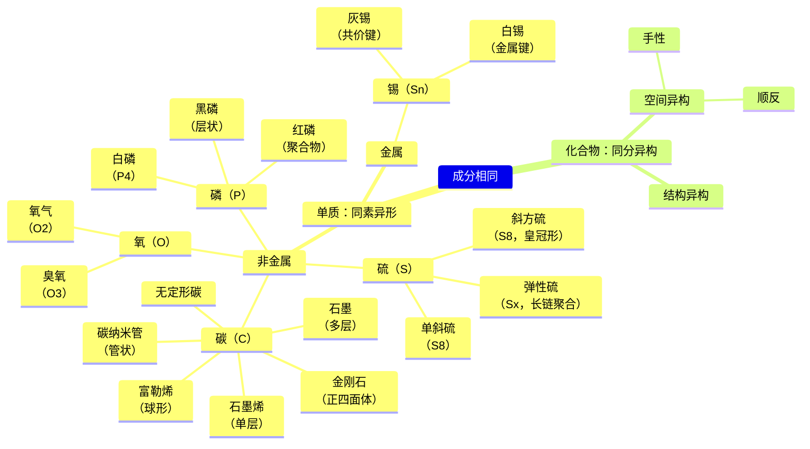

---
{"dg-publish":true,"permalink":"/知识/自然科学/同素异形和同分异构/","title":"同素异形和同分异构","noteIcon":""}
---

> 如何鉴别两个成分相同的物质是否为相同的化学物质？

黄金标准：化学性质有核外电子排布决定。
- 分子排列不同
	- 物态变化
	- 晶型变化
- 分子结构
	- 成分相同（分子式）
	- 结构相同
	- 连接方式相同（化学键）
	- 空间构型相同（立体构象）
- 原子核结构
	- 中子数不同（同位素）

