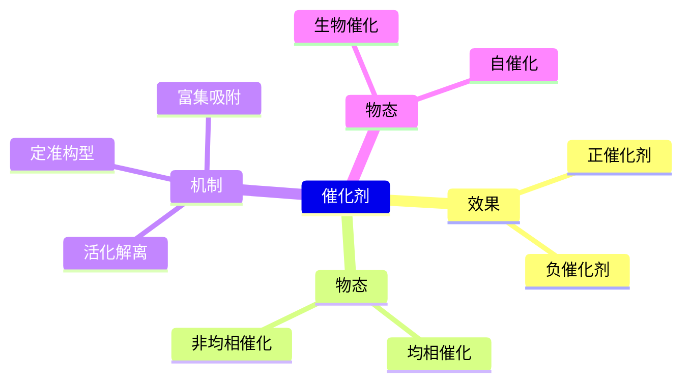

---
{"dg-publish":true,"permalink":"/知识/自然科学·化学/催化剂/","title":"催化剂","tags":["自然科学/化学"],"noteIcon":""}
---

> 原理：改变活化能从而影响化学反应的速率

```mermaid
mindmap
催化剂
  效果
    正催化剂
    负催化剂
  物态
    均相催化
    非均相催化
  机制
    富集吸附
    活化解离
    定准构型
  物态
    生物催化
    自催化
```