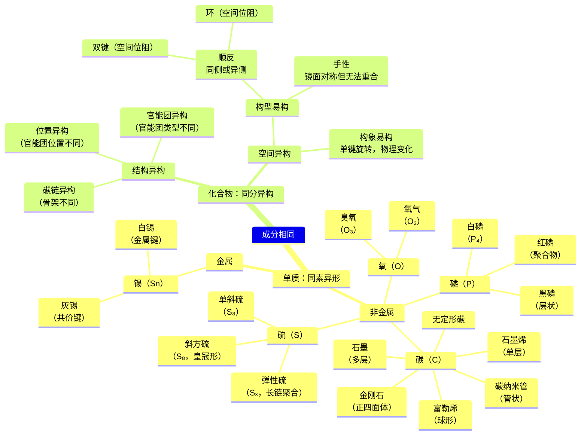

---
{"dg-publish":true,"permalink":"/知识/自然科学·化学/同素异形和同分异构/","title":"同素异形和同分异构","tags":["自然科学/化学"],"noteIcon":""}
---

> 如何鉴别两个成分相同的物质是否为相同的化学物质？

```mermaid
mindmap
成分相同
  单质：同素异形
    非金属
      碳（C）
        金刚石<br/>（正四面体）
        石墨<br/>（多层）
        石墨烯<br/>（单层）
        碳纳米管<br/>（管状）
        富勒烯<br/>（球形）
        无定形碳
      氧（O）
        氧气<br/>（O₂）
        臭氧<br/>（O₃）
      磷（P）
        白磷<br/>（P₄）
        红磷<br/>（聚合物）
        黑磷<br/>（层状）
      硫（S）
        斜方硫<br/>（S₈，皇冠形）
        单斜硫<br/>（S₈）
        弹性硫<br/>（Sₓ，长链聚合）
    金属
      锡（Sn）
        白锡<br/>（金属键）
        灰锡<br/>（共价键）
  化合物：同分异构
    结构异构
      碳链异构<br/>（骨架不同）
      位置异构<br/>（官能团位置不同）
      官能团异构<br/>（官能团类型不同）
    空间异构
      构型易构
        顺反<br/>同侧或异侧
          双键（空间位阻）
          环（空间位阻）
        手性<br/>镜面对称但无法重合
      构象易构<br/>单键旋转，物理变化
```
